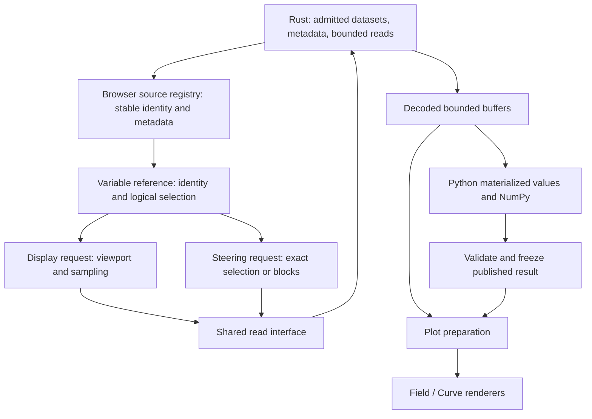

# Steering interface proposal

Status: proposed, not implemented. Revised 2026-09-17. This revision replaces
view-buffer-only Steering with source-backed variables and explicit reads.
Names below describe the proposed interface, not available commands.
Workflow and migration: [comparison plan](comparison-plan.md).
Terms: [Steering context](steering-context.md).
Runtime evidence: [runtime research](steering-runtime-research.md).

## Design decision

Rust owns open files, source metadata, decoding, and bounded reads. The browser
owns admitted source identities, plot bindings, and presentation. Python owns
its namespace and materialized arrays. A plot consumes a binding to data; it
does not own the scientific variable. Toolbars and Steering issue commands to
the same plot-state owner.

A source variable describes its whole logical domain without loading it.
Steering can select and read any part of that domain, including every sample
through blocks. A display request can select a smaller region and stride from
the same variable. Display sampling never becomes the implicit input to a
calculation.

Use normal NumPy on explicitly materialized arrays. Do not implement an allowed
function list, intercept NumPy operations, or build a lazy expression engine.
This means arbitrary NumPy code is not automatically made safe for data larger
than memory. Full-domain access, full-array allocation, and bounded block
processing are separate operations with different resource contracts.

## Terminal and living variables

Steering opens a resizable bottom panel across the full viewer width, including
beneath the dataset sidebar. In an embed, this means the iframe's width. The
upper plots and navigation shrink together; the terminal does not cover them.
It is completely hidden when closed and loads Python only on first open. The
right-aligned hub topbar actions are `Steering`, `Save PNG`, `Open another
address`, and `Close Session`, in that order. Steering is a pressed-state toggle;
there is no separate Hide button or collapsed panel strip.

```text
+-------------------+---------------------------------------------+
| ncx                 Steering  Save PNG  Open another address Close|
+-------------------+---------------------------------------------+
| Dataset navigation| Toolbar, Field / Curve, optional panel 2     |
|                   |                                             |
+-------------------+---------------------------------------------+
| Outline           | Python                              Options |
| Sources1          | Log: commands, results, and errors           |
|  > /temperature   |                                             |
|  > /wind          +---------------------------------------------+
| Workspace         | >> t = sources.s1["/temperature"]            |
|  > t              |                                             |
+-------------------+---------------------------------------------+
| Existing status surface                                         |
+-----------------------------------------------------------------+
```

The compact Outline sidebar shows admitted source variables and user names in the current
Python namespace. Align its right edge with the main dataset sidebar through
one shared width setting. Group source paths under `Sources1`, `Sources2`, and
so on; these display labels resolve to stable aliases `s1`, `s2`. Clicking
`/wind` inserts `sources.s1["/wind"]` at the input cursor without execution.
Keep the list compact; expose kind, shape, dtype, unit, and storage state through
inspection. Distinguish the full logical byte estimate from
resident array bytes. A variable is not a preview merely because a plot uses a
preview of it. Selecting a name inserts its reference into the command input;
it does not read data or change a plot.

Build the list from the source registry and namespace after execution, including
execution that ends in an error. Do not maintain a second mutable variable
catalog. Show aliases as names for one object, without counting its storage
twice. Array views can share storage; displayed byte estimates are not process
memory measurements. Do not call arbitrary object properties or `repr`, scan
values for min/max, or fetch coordinates to draw the list. Unknown objects get
a type label. Page large lists and cap each update; no polling during execution.

Use the current editor, surface, and focus conventions from
[Style/Web](../../../Style/Web/web-design.md). Provide keyboard resizing,
visible focus, a labelled variable list, and separate scrolling for list and
output. Keep the two sidebar edges aligned when the viewport narrows. Use Commit
Mono Web for the terminal, including input, log, and variable references, with
literal characters and disabled ligatures. Use locally packaged
[Speed Highlight](https://github.com/speed-highlight/core) for Python input and
submitted commands. Highlighting does not determine Python execution semantics.

Use a command console: Enter executes complete input immediately; Shift+Enter
inserts a new line, and Up/Down recalls history. In the real runtime, Python's
own completeness check keeps incomplete input open for continuation; do not
write a second Python parser. A complete invalid command reports its syntax
error. Do not execute while typing or after a source change.

Remove Run: Enter is the submit action. Show Stop only while an execution is
active, including when input is waiting for a read. Keep Reset workspace in the
terminal options menu with Clear log; clearing the log does not clear variables.
Closing through Steering retains input, log, workspace, and published plots.
Stop ends execution; Reset explicitly discards the workspace. Neither resets
accepted plot content. Panel reset is a separate command.

The [interactive draft](draft.html) demonstrates this layout, insertion,
highlighting, history, and submission with sample data. It does not execute
Python. Serve it from the workspace root with
`python -m http.server 8765 --bind 127.0.0.1`, then open
`/ncx/docs/Progress/draft.html`. Use `?context=standalone` to omit hub actions.

## Data representation and provision



The common external seam is variable description plus bounded selection read.
The browser and Python use adapters at this seam. It hides transport, read
admission, decoding, and request lifetime. It is not a second data server.
Reuse the existing `SliceRequest`, `DataSlice`, metadata, and source feed, then
move plot acquisition to this shared interface. Do not build another catalog
by inspecting arrays held inside React plots.

| Representation | Single owner | Required information and invariant |
| --- | --- | --- |
| File metadata | Rust dataset module | Canonical variable/dimension paths, shapes, source types, units, coordinate and topology references; no eager data arrays |
| Source registry | Browser source state | Admitted dataset IDs and supplied series, stable aliases, source epoch; session unit assignments are explicit metadata overrides |
| Variable reference | Immutable value | Source epoch, source ID, variable path, ordered index selection, decoded dtype; metadata is resolved from the registry |
| Materialized value | Python workspace, or browser read owner | Values, ordered dimensions, selection coordinates, unit and sampling; never a writable reference into the other owner's storage |
| Published value | Browser plot state | Frozen result and required axes/geometry, bounded lifetime; independent of later Python mutation |
| Plot binding | Browser plot state | Data reference, extraction, and content intent; describes what Field or Curve displays |
| Presentation | Browser plot state | Viewport, range, scale, colour, supported display unit and offset; does not mutate scientific values |

For plot input, storage is a tagged choice: source reference or published
value. These cases differ in read and lifetime rules. Both provide the same
variable description and selection semantics to plot preparation. Supplied
external series already have resident storage; adapt them to that interface
without pretending they are NetCDF files. A derived value is not an external
source and does not consume an Add slot.

Use canonical dimension paths, including groups, as dimension identities.
Friendly names are shorthand only when unambiguous. Selection records integer
indices or half-open ranges with positive strides in dimension order. Shape
and byte count are derived, not separately editable fields. Coordinates carry
units and time calendars; geometry carries topology, connectivity, and native
node/face/edge location. References to coordinates and topology remain lazy.
Reading a small scalar slab must not silently load a complete coordinate grid
or mesh. Plot preparation admits its required geometry separately.

Scientific reads use decoded values before display units, offsets, colour
mapping, or decimation. Preserve Rust fill/missing handling and scale/offset
order. Record source type and decoded dtype separately. Default Steering
numeric reads to the existing f64 wire option; allow explicit f32. This does
not provide exact arbitrary 64-bit integer access. Keep connectivity on its
integer path. Unsupported precision must be stated, not hidden by calling
viewer floats “raw” file values.

Aliases are stable keys, not source-list positions. Removing `s1` never makes
another source become `s1`. Labels and order alone do not change the epoch.
Source replacement creates a new epoch. Only Add and the existing host admission
interface introduce external sources. Python
receives admitted identities, never server file paths or NetCDF handles.

## Small proposed Python interface

`sources` exposes the metadata catalog. `view` is a capture of the current
logical plot selections at submission, before viewport clipping and display sampling.
Neither contains pixel buffers. `np` is NumPy. `plots.field` and `plots.curve`
address the primary plot bindings; `panel2` addresses the existing curve panel.
Showing a binding does not change the active Field/Curve tab.

```python
t = sources.s1["/temperature"]                 # reference, no data read
surface = t.isel({"/time": 12, "/level": 0})   # reference, no data read
plots.field.show(surface)                     # viewport reads as usual

a = await surface.read()                      # exact selected domain, if it fits
anomaly = a.with_values(a.values - np.nanmean(a.values),
                        unit=a.unit, unit_kind="delta", name="Temperature anomaly")
plots.field.show(anomaly)                     # publish a frozen field
```

`isel` composes an index selection without I/O. `read` is asynchronous and
checks the entire requested allocation before fetching. It never substitutes
a display stride to make a scientific read fit. `with_values` preserves the
axes and geometry of a same-shape result and requires its unit declaration.
It does not prove that an operation preserved sample order or physical meaning.
Changed shape or coordinates require explicit construction with `Array(values,
dims=..., coords=..., unit=..., name=...)`; unknown geometry is not inherited.

```python
a = await view.s1.read()                      # full logical extraction, not pixels
b = await view.s2.read()
await view.match(a, b)                        # check sample coordinates and units
d = a.with_values(a.values - b.values, unit=a.unit,
                  unit_kind="delta", name="A minus B")
panel2.show(d)                                # requires a curve-compatible result
```

In later submissions:

```python
panel2.clear()                                # hidden; variables remain
```

```python
panel2.reset()                                # restore current default intent
```

`view.match` resolves the selected coordinates through bounded reads and checks
equal sample coordinates after supported coordinate-unit normalization. It checks
value-unit compatibility but does not rewrite inputs; values in different scales
must be explicitly converted before subtraction.
It does not interpolate or infer meaning from station IDs or quantity names.
Normal NumPy arithmetic remains normal NumPy; callers can choose to bypass
this helper. Each plot constructor still validates dimensions and axes. Coordinate
identities from the same epoch and selection can prove equality without a read;
different identities require comparison, not a shape-only guess.

Source references deliberately reject implicit array conversion at the type's
conversion hook; no per-function registration is needed.
`np.asarray(t)` or `np.mean(t)` must fail with “Read a selection or iterate
blocks first”; printing `t` must remain metadata-only. Once `a.values` is a
NumPy array, functions supported by the installed NumPy run without an ncx
function list. Unsupported plot results can remain ordinary Python variables.
Scalars are shown in the terminal unless explicitly constructed into plot data.

### Whole-domain work without whole-domain allocation

`blocks` partitions a logical selection at stride one unless the user selected
a different stride. Each yielded value records its global index ranges. The
reader chooses bounded slabs, may split multiple dimensions, and returns each
selected sample exactly once. It preserves dimension order and missing values.
One outstanding read and no prefetch is the first implementation.

```python
total = np.float64(0)
count = 0
async for block in t.blocks():
    finite = np.isfinite(block.values)
    total += np.sum(block.values, where=finite, dtype=np.float64)
    count += np.count_nonzero(finite)
    del block, finite
mean = total / count if count else np.nan
```

This examines the whole variable, independent of any visible Field or Curve.
It holds one admitted block plus the caller's temporaries. Never average block
means without their valid counts. Chunk order can change floating-point rounding;
this is not a promise of bit-identical agreement with an eager reduction.

The iterator bounds its own buffers. It cannot stop a user retaining every
block in a list. `read()` rejects an oversized result before I/O even when the
file could be read in chunks: assembling those chunks would still allocate the
whole result. Chunking also does not make an arbitrary FFT, sort, or matrix
operation a streaming algorithm. Such work needs an explicit algorithm or a
different execution environment.

Do not automatically run a Python function per display tile: neighbourhoods,
reductions, and global transforms have different semantics. The first version
publishes derived arrays only when the complete result and plot geometry fit.
A full scan with a small result is supported; an unbounded derived cube is not
silently cached, recomputed per viewport, or written to a server scratch file.
A lazy derived-data engine is a separate design, if required.

## Plot bindings and toolbar ownership

A binding chooses data and extraction. Presentation chooses how to draw it.
The toolbar and Steering both call the same owner; renderers only consume
prepared inputs. They do not pass writable arrays to each other.

| Action | Data and workspace effect | Plot effect |
| --- | --- | --- |
| Colour, range, supported display unit, Y offset | None | Update presentation only |
| Pan, zoom, resize, preview refinement | None | May schedule new bounded display reads; never run Python |
| Select variable, time, level, probe, or curve axis | Update logical selection; existing Python values remain captures | Update default bindings; explicit user results remain pinned to their own axes |
| Toolbar extraction on an explicit binding | Change only that binding's selection within its available dimensions | Read/select that data; never retarget it to an unrelated source |
| Successful show | Freeze a resident result, or bind an admitted source reference | Replace target content; retain compatible current presentation |
| Clear | No namespace change | Set user-hidden; host refresh cannot reopen it |
| Panel reset | No namespace change | Restore latest default binding |
| Host default update | No Python execution | Update default intent; keep active user override |
| Source admission, removal, replacement, or source-unit reassignment | Advance source epoch; stop/reset workspace, keep input history | Invalidate old user data; preserve intent and show rerun status |
| Viewer generation replaced | Discard all session state | Start a new viewer |

An explicit time-12 result stays at time 12 when the normal viewer selects time
13. Its own labels and selection controls must say time 12. Disable unavailable
axes with a reason; do not pretend a fixed 2-D result still has a time axis.
Reset returns the plot to the normal viewer selection. This keeps stored
results useful without silently treating them as new calculations.

Represent content intent as `default`, `user-data`, or `user-hidden`, rather
than competing booleans. `user-data` contains a source binding or a published
value. Source invalidation leaves that intent unavailable until rerun or reset;
it does not fall back to host content. Add `user-transform` only if automatic
execution is later designed. Host source refresh and host default-panel updates
must be separate commands; the existing combined `setSources` needs migration.

Curves sharing X need compatible coordinate domains and axis units, including
time calendars. Curves sharing Y need compatible declared Y units, not equal
observed minima/maxima. Show the union of valid ranges. Equal endpoints and
lengths do not prove alignment. Preserve gaps. Absolute temperature and a
temperature difference have different conversion rules; `unit_kind` declares
that distinction. Ratios declare dimensionless units. Quantity, station,
provider, and datum are metadata, not generic plot-admission gates.

Fields need valid displayed dimensions and matching native coordinates and
topology. Reuse existing rectilinear, curvilinear, and mesh preparation. Do not
turn face values into node values, infer a mesh from shape, or invent spatial
alignment. Panel 2 remains a curve panel with compatible linked X navigation;
it is not a second field renderer. No steering-specific chart engine is needed.

## Execution, revisions, and publication

Keep one namespace across manual runs and ordinary selection changes. `view`
is refreshed at the start of each run, then stays fixed for that run. Earlier
`a` remains its earlier capture, with its own axes and selection. Do not change
its values when the toolbar moves. Assignment alone does not change a plot.

Separate three identities:

- **Source epoch** changes when admitted scientific inputs or their interpreted
  source metadata change. Conservatively reset all user globals on this change.
  Arbitrary NumPy expressions do not carry dependable provenance, so do not
  pretend to invalidate only variables discovered by a dependency scanner.
- **Selection revision** changes for logical extraction changes, including a
  toolbar edit to a binding. It does not change for viewport sampling or style.
- **Content revision**, per plot, changes for show, clear, or reset. A late run
  must not replace a newer user choice.

At submission capture the source epoch, selection revision, and target content
revisions. Read requests carry the epoch and run identity. Discard replies
from a removed source or stopped run. At successful completion, validate all
staged plot updates and commit them together only if these identities still
match. A selection change discards pending publication but need not destroy
finished Python assignments. This conservative rule also applies to a run
using explicit sources; no hidden analysis of which Python code used `view`.

Only the last content command for each plot in a submitted block is retained.
An exception, Stop, limit failure, or stale revision commits none of the staged
updates. Python assignments have ordinary Python semantics; this is not a
transaction over arbitrary globals or external side effects. Freeze values
when show is called so later writes in the same block cannot alter the staged
result. Validate and reserve bytes before this copy. Release replaced staging.
If coordinate or topology references remain lazy, pin their epoch and resolve
the required plot geometry under read admission before commit. This can finish
after Python execution; all revision checks still apply. Do not fetch unrelated
whole-file coordinates as part of freezing values.

Publication keeps the latest presentation if compatible. An incompatible unit
or axis change resets only the affected presentation through the normal plot
rules. Python's first interface does not set style, so no per-property override
system is needed. Renaming or deleting a Python variable does not remove an
accepted result. Stop or workspace reset releases Python storage; accepted
browser results remain until replacement, clear, or source invalidation.

The source epoch identifies an application snapshot, not a filesystem snapshot.
The first version requires stable files for the duration of reads. External
writers and growing files remain unsupported. A long scan cannot claim atomic
file consistency merely because all blocks have the same browser epoch.

## Memory admission and large files

File size is not allocation size. Estimate selected decoded values, required
coordinates/topology, transport buffers, publication copies, and plot work.
Compressed file bytes are not a useful estimate for these allocations.

Reuse existing Rust limits and read reservations in
[dataset.rs](../../src/dataset.rs), [reading.rs](../../src/reading.rs), and
[server.rs](../../src/server.rs). They validate ranges, checked products, wire
size, and estimated read memory before allocation. Per-dataset reads remain
serialized and blocking NetCDF work remains off the async executor. Native
library caches and decompression can add memory beyond those reservations;
the reservation is not a process RSS cap.

The browser currently has separate cache and display limits in
[api.ts](../../web/src/data/api.ts), [cache.ts](../../web/src/data/cache.ts), and
[selection.ts](../../web/src/data/selection.ts). Cache eviction only releases
cache ownership. A plot, request, Python object, or transfer can still retain
the same storage. Do not report the cache limit as total viewer memory.

Add byte admission at the shared read/publication seam. Reserve estimated peak
owned buffers before a request or copy, not after receipt. Include concurrent
plots and Steering, old accepted content while a replacement is staged, decode
conversion, coordinate/geometry buffers, and raster/GPU preparation. Count each
owned buffer once; count each real cross-owner copy. Bound entries and pending
requests as well as bytes. Reject a replacement that cannot coexist with its
old result; retain the old plot.

Use separate, explicit ceilings for transport response, one materialized read,
one scan block, retained published content, staging, and console/history. Define
them once in executable policy when implemented; measure the pinned runtime
before choosing new defaults. A block must fit both the Rust response limit and
remaining browser read allowance. An oversized coordinate or mesh dependency
must fail admission too. Do not increase existing limits just to admit Steering.

There are two different guarantees:

1. ncx can bound buffers and work that it owns through its read and plot
   interfaces. Use checked arithmetic and validate response shape and byte
   length. Cancellation releases pending reservations; an active native read
   keeps its reservation until it actually ends.
2. Arbitrary Python can allocate copies, aliases, temporaries, and other objects
   outside that accounting. Namespace `nbytes` totals and timeouts cannot hard-cap
   its peak memory. A browser worker therefore cannot promise a hard per-run or
   whole-tab memory bound. Allocation failure may require a worker restart and
   can affect the tab before a recoverable Python exception occurs.

For the first runtime, make bounded reads plus honest allocation limits the
contract. Do not solve arbitrary Python memory by maintaining function lists.
If hard isolation for arbitrary full-data programs is required, the browser
runtime remains unapproved for that requirement. An OS process with resource
controls is a different deployment and authority decision.

## Performance and implementation path

The current code has useful seams, but not the complete design:

| Current implementation | Reuse and required change |
| --- | --- |
| `Dataset::plan_read` and read admission | Reuse exact bounded reads and decoding; no server Python endpoint |
| `fetchSlice`, `LatestSliceLoader`, `useSlice` | Reuse transport validation and latest display selection; place Steering reads behind shared admission |
| `fieldRequest` | Retain viewport/stride policy for display only |
| `curveRequest` and `CurveView` | Currently read a full selected line; do not describe all curves as tiled/lazy |
| `fetchCoordinate`, mesh preparation | Currently can request complete coordinates/connectivity; account for these before claiming large-file support |
| `StructuredRaster`, curve series and plot renderers | Adapt prepared source and published data to the existing drawing inputs |
| `sourceFeed` and viewer selection state | Reuse identity and control ownership; separate source, selection, and content revisions |

Keep Python in one optional worker. Ordinary viewing must work without Python
assets. The worker bridge requests admitted selections through the browser's
existing session-aware transport. It does not carry credentials into Python or
bypass hub/session handling. Transfer owned buffers where possible; do not detach
buffers still used by a plot or cache. Copy across the Python heap where needed
and release interop proxies. Do not promise end-to-end zero-copy transport.

Allow one execution and one outstanding Steering read. Keep the input editable
while busy, but do not accept another submission or queue input blocks. Show
the active state and Stop control. Between scan blocks give pending interactive reads
priority, then continue the scan. An active native read may still delay the
next display request. Use one bounded block and no prefetch first. Do not insert
scan blocks into a display cache or populate all arrays when the terminal opens.

Measure cold/warm worker startup, NumPy loading, first variable listing, read
latency, transferred bytes, Python conversion, compute, publication, render,
retained memory, and peak memory where measurable. Separate small point curves,
a viewport from a very large field, a full scan with a scalar result, a six-source
calculation, and a mesh whose geometry dominates values. Measure through SSH
and in cuSURGE as well as locally. Report file chunking/compression and request
counts; small slabs can repeatedly decompress the same storage chunks. Choose
chunk alignment from measurements, not a new speculative scheduler.

Implement the shared data representation and source/resident plot adapters
before the terminal bridge. Then prove manual reads, block scans, publication,
and Stop in a runtime spike. Automatic transforms, automatic dependency graphs,
disk spill, and a custom lazy NumPy backend are outside this revision. Keep
current cuSURGE calculations until a generic interface preserves their updates.

## Acceptance checks

These are implementation checks, not measurements completed by this proposal.

| Scenario | Required result |
| --- | --- |
| Open Steering on a very large file; list variables | No numeric reads or per-value summaries; whole shapes visible |
| Plot has a strided preview; calculate full mean | Every selected sample is read through exact blocks; answer independent of viewport |
| Single row exceeds a block budget | Split more than one dimension; no unchecked full-row allocation |
| Uneven blocks and missing values | Global valid sum/count; no mean-of-means error |
| Oversized read/result/geometry or integer overflow | Reject before allocation/copy; no silent stride or partial publication |
| Change colour or pan during Run | No Python rerun; compatible current presentation survives commit |
| Change probe during Run | Pending publication rejected; captured arrays do not change |
| Edit one explicit field's time selector | Only its binding changes; stored NumPy values do not change |
| Show, then mutate array; show, then raise | First case freezes show-time values; second commits nothing |
| Remove/reorder/replace source; reuse alias | Stable identity; late read rejected; no accidental alias reassignment |
| Host refresh after show/clear/reset | User intent preserved; reset restores latest valid default |
| Retain many blocks, allocate excessive temporaries | No false hard-memory claim; exercise failure and worker restart |
| Stop a loop or scan | Worker ends; queued reads/staging released; no stale result commits |
| Hide/reopen terminal; delete name | Workspace survives hiding; accepted plot survives name deletion |
| Field geometry and Curve export | Reuse existing renderers; units, gaps, sampling, topology remain correct |
| Keyboard resize and narrow/embedded layout | Bottom panel spans viewer; plot remains usable and focus visible |
| No Python assets; local/HTTP/HTTPS/iframe | Ordinary viewing works; runtime and Stop tested in supported deployments |
